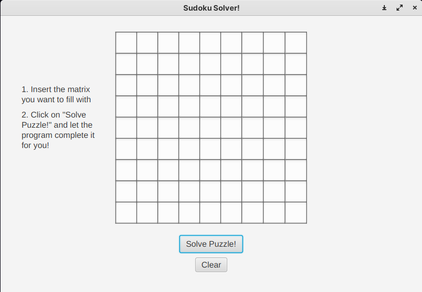

# Solucionador de Sudoku

Este projeto foi realizado como um dos requisitos para a aplicação de uma vaga de **programador jr.** na Mega News.

O programa consiste em um solucionador de Sudoku, onde de maneira simples, o sistema consegue resolver qualquer matriz de Sudoku em um clique. 


## Screenshots



## Desenvolvimento
### Escolha de tecnologias

O programa foi construído com: 
- **Kotlin**
- **JavaFX** - uma biblioteca gráfica que permite a criação de telas em Java.

### Por que tais tecnologias?

A linguagem Kotlin possui uma sintaxe muito simples e compreensível, dessa forma, escrever código em Kotlin se torna mais produtivo. Já o JavaFX possibilita a criação de telas com personalizações mais amplas e uma melhor experiência de usuário. Apesar do "Java" em seu nome, a biblioteca é totalmente compatível com o Kotlin já que as duas linguagens são interoperáveis.

## Como funciona?
    
- O sistema recebe uma matriz de Sudoku não preenchida
- Utilizando um algoritmo de backing track (tentativa e erro), o sistema preenche todas as posições da matriz com um possível número até que uma solução seja encontrada
- A matriz resolvida é então exibida na tela


## Como executar:

**Obs.** -> Necessita JavaFX JDK 21 ou superior

Com o comando abaixo, execute o pacote **.jar** disponibilizado:

```bash
  java -jar SudokuChallenge.jar
```
Ou abra em um IDE IntellijIdea/Netbeans/Eclipse
